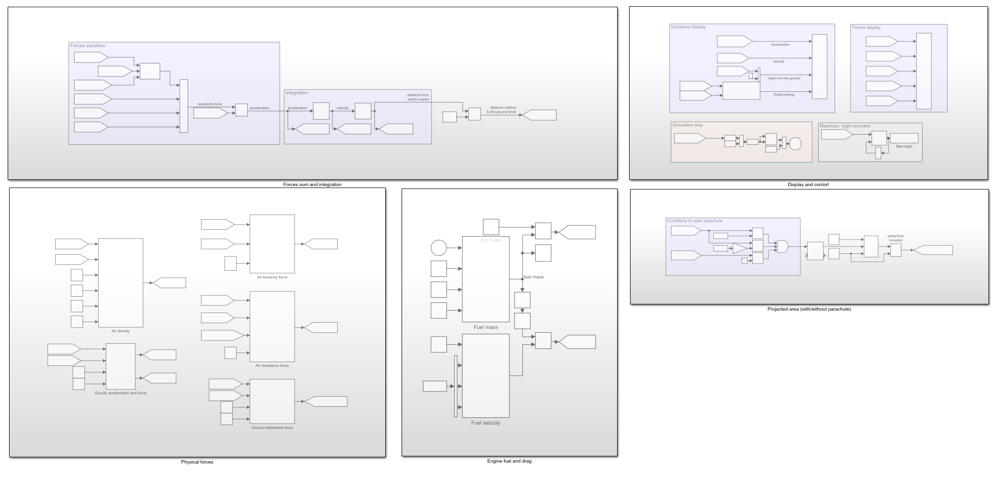
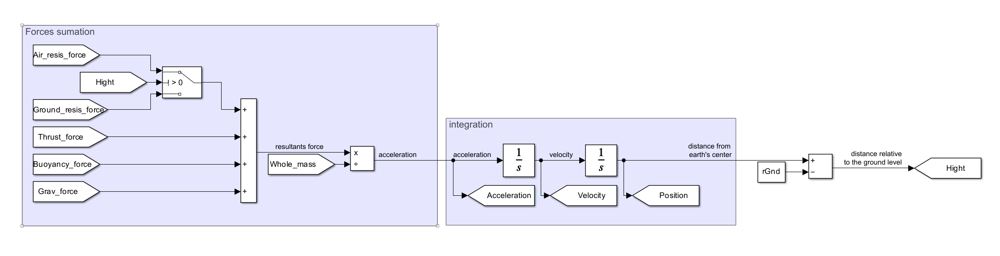
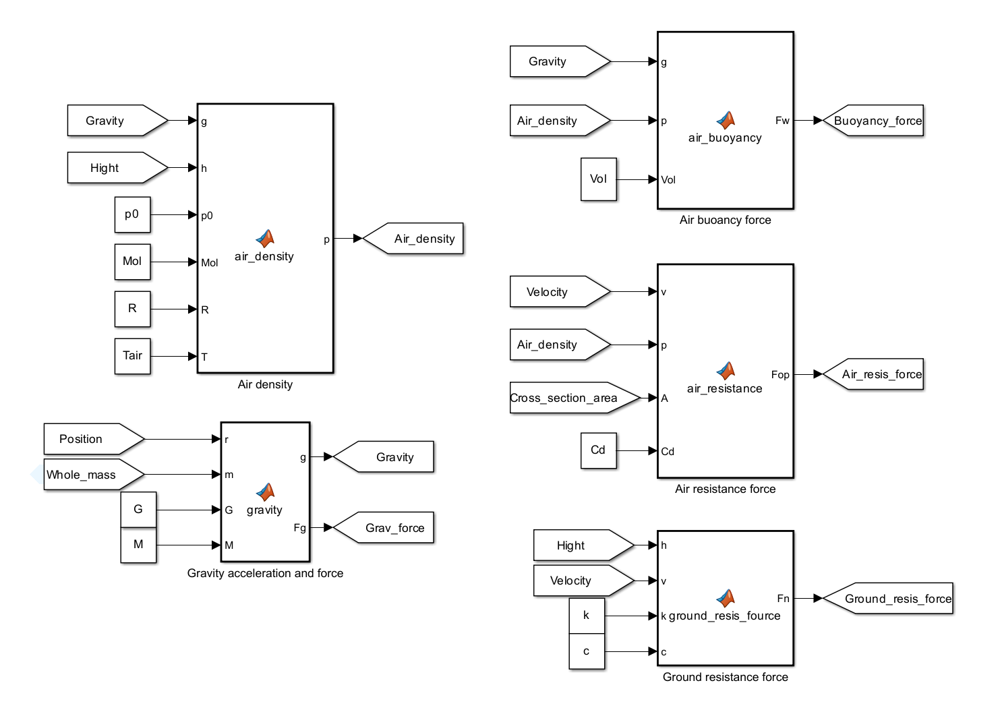
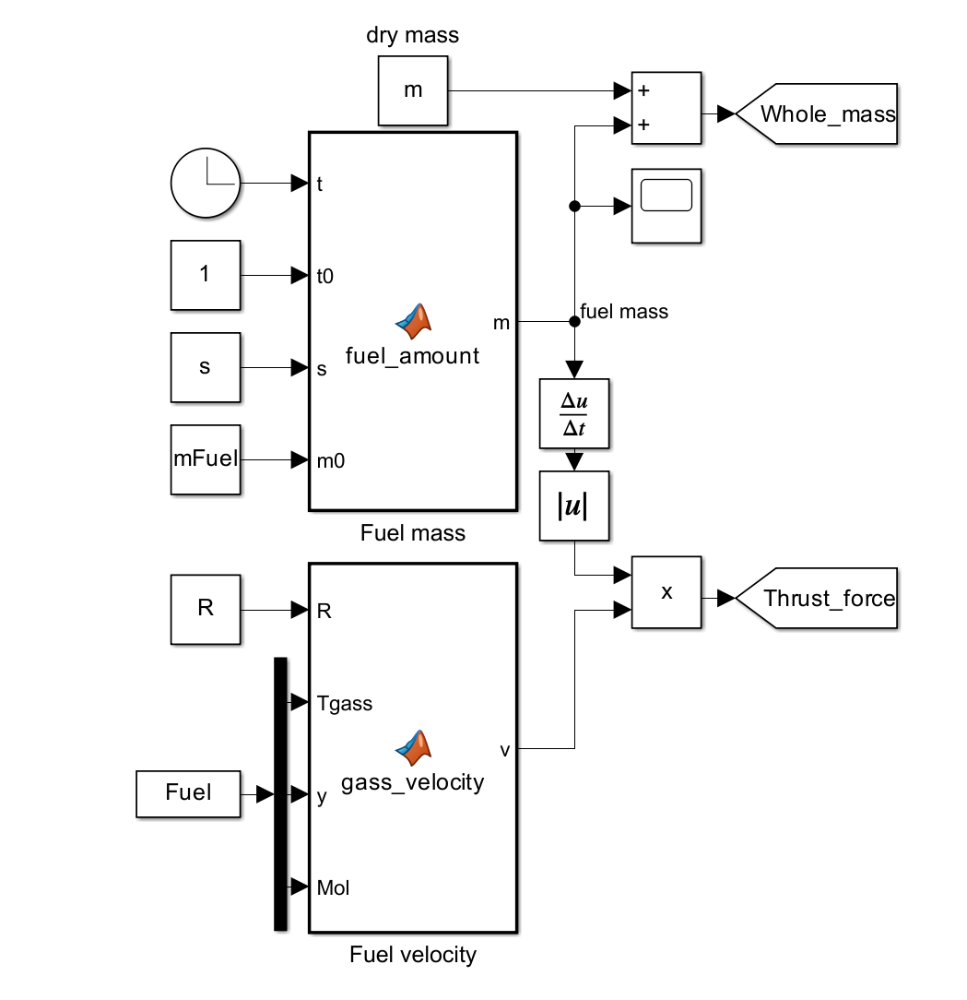
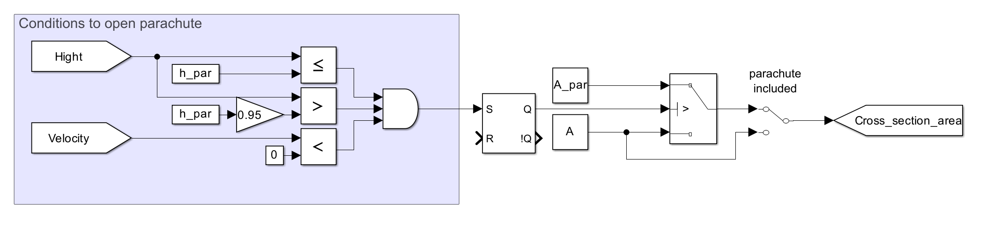
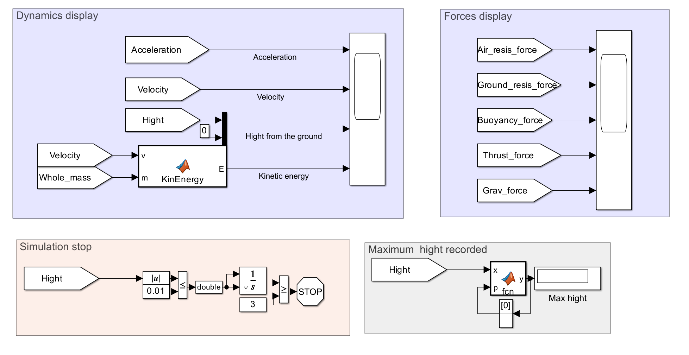
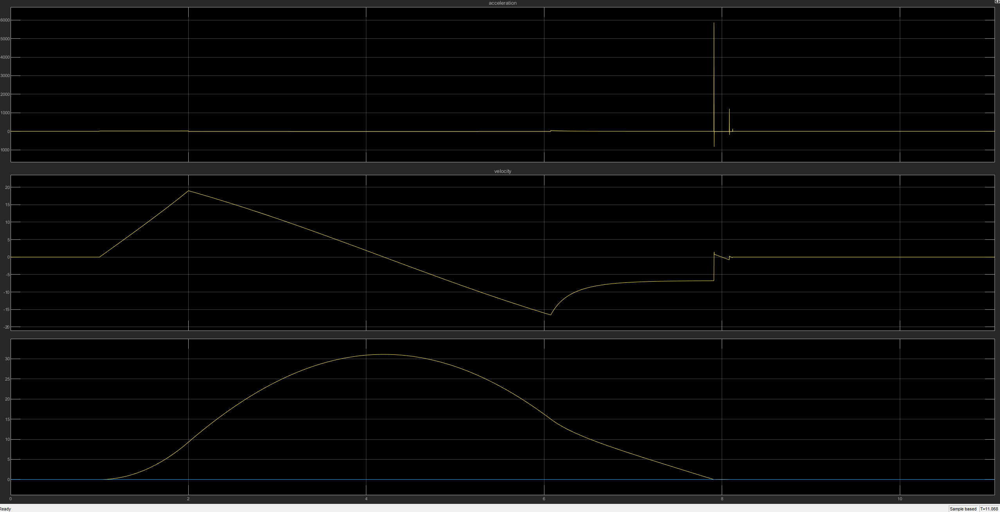
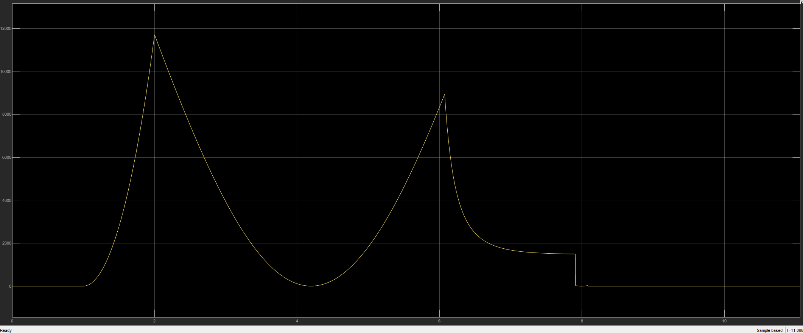
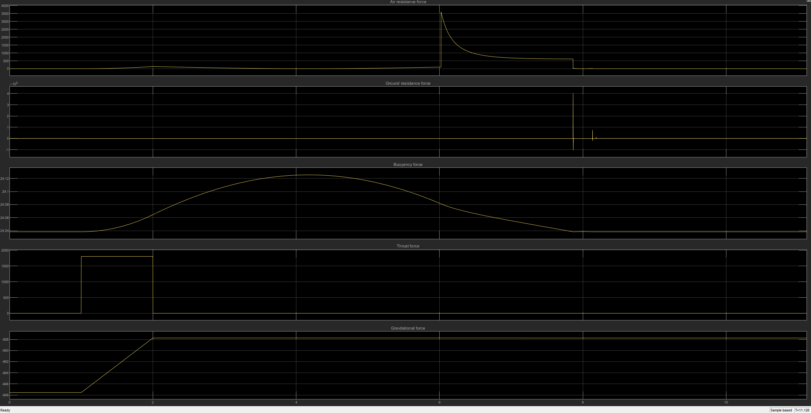

# Rocket-Flight-Simulation

This project simulates the vertical flight of a rocket taking into account:

- Thrust force (jet propulsion)
- Gravity (variable with altitude)
- Air resistance (drag force)
- Buoyancy force (air displacement)
- Ground reaction force (landing impact model)
- Parachute deployment at a specified altitude
- Kinetic energy over time

The simulation models realistic physical behavior using numerical methods in MATLAB Simulink.

---

## ⚙️ Physical Model

### Equation of motion

$$
m \frac{dv}{dt} = F_{\mathrm{thrust}} + F_{\mathrm{gravity}} + F_{\mathrm{drag}} + F_{\mathrm{buoyancy}} + F_{\mathrm{ground}}
$$

---
### Gravity force

$$
F_{\mathrm{gravity}} = \frac{G M m}{\left(r_{\mathrm{earth}}\right)^2}
$$

---
### Drag force

$$
F_{\mathrm{drag}} = \frac{1}{2} \rho(h)\ C_d \ A\ v^2
$$

---
### Buoyancy force

$$
F_{\mathrm{buoyancy}} = \rho(h)\ V\ g(h)
$$

---
### Air density model

$$
\rho(h) = \rho_0 \exp\left(-\frac{M_{\mathrm{mol}}\ gh}{RT}\right)
$$

---
### Parachute deployment

$$
A =
\begin{cases}
A_{\mathrm{par}}, & \text{if } h < h_{\mathrm{par}} \text{ and } v < 0 \\
A, & \text{otherwise}
\end{cases}
$$

---
### Ground contact force

$$
F_{\mathrm{ground}} = -k h - c v
$$

---
### Acceleration

$$
a = \frac{F_{\mathrm{total}}}{m}
$$

---
### Kinetic energy

$$
E_k = \frac{1}{2} m v^2
$$

---

## 🪂 Parachute System

The simulation includes parachute deployment:

- Activated at a defined altitude
- Significantly increases drag force
- Reduces landing velocity

---

# Model view:

### General view

  

### Forces sum and integration view

  

### Physics and engine model view

  
  

### Projected area (Parachute model)

  

### Scopes and simulation stop condition

  

---

## 🧪 Simulation Parameters

### Environment:

| Parameter |    Value    |       Description      |
|-----------|-------------|------------------------|
| G         | 6.6743e-11  | Gravitational constant |
| M         | 5.98e24 kg  | Earth mass             |
| p0        | 1.225 kg/m³ | Air density at ground  |
| Tair      | 288 K       | Air temperature        |

### Rocket:

| Parameter | Value | Description |
|----------|------|-------------|
| m        | 65 kg | Dry mass |
| A        | 0.6 m² | Cross-sectional area |
| Cd       | 1.1   | Drag coefficient |
| Vol      | 2 m³  | Volume |

### Fuel:

| Parameter | Value | Description |
|----------|------|-------------|
| mFuel       | 1kg   | Fuel mass |
| s        | 1kg/s |Fuel consumption slope|
| Fuel[0]   | 1920K |Chamber Temperature|
| Fuel[1]   | 1.27 |Gamma / Heat Capacity Ratio|
| Fuel[2]   | 0.04608 kg/mol|Fuel molar Mass|

### Parachute:

| Parameter | Value | Description |
|----------|------|-------------|
| A_par    | 20 m² | Parachute area |
| h_par    | 15 m  | Deployment altitude |

### Ground:

| Parameter | Value | Description |
|----------|------|-------------|
| k        | 1e8   | Stiffness |
| c        | sqrt(k*m) | Damping coefficient |

---

## 📊 Results
Every parameter has values in SI unit.
The simulation generates multiple plots:

- Acceleration [m/s^2] vs Time [s]
- Velocity [m/s] vs Time
- Height [m] vs Time  

  

- Kinetic Energy [J] vs Time [s]

  

- Forces [N] vs Time [s]

  

Maximum hight: 30.57m

Time of parachute deployment: 6.02s
