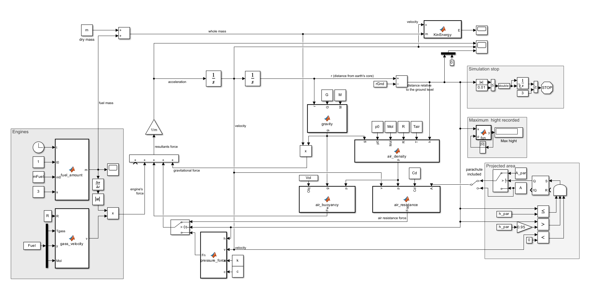

# Rocket-Flight-Simulation

This project simulates the vertical flight of a rocket taking into account:

- Thrust force (jet propulsion)
- Gravity (variable with altitude)
- Air resistance (drag force)
- Buoyancy force (air displacement)
- Ground reaction force (landing impact model)
- Parachute deployment at a specified altitude
- Kinetic energy over time

The simulation models realistic physical behavior using numerical methods.

Model view:

---

## ⚙️ Physical Model

The rocket motion is described by Newton’s second law:

